# Enterprise Web Development - Assignment 1.

**Name:** Cathal O'Connor

## Overview.

- Cast Section and biography page for moview and tv shows.
- Similar movies/tv shows section and pages.
- Authentication using supabase.
- Favourite TV Show list using supabase.
- Favourite movie list using supabase.
- Popular TV shows page
- Upcoming Movie page

## Feature Design.

#### Cast Section and biography page for moview and tv shows.

> Cast section showing multiple members of the cast
> 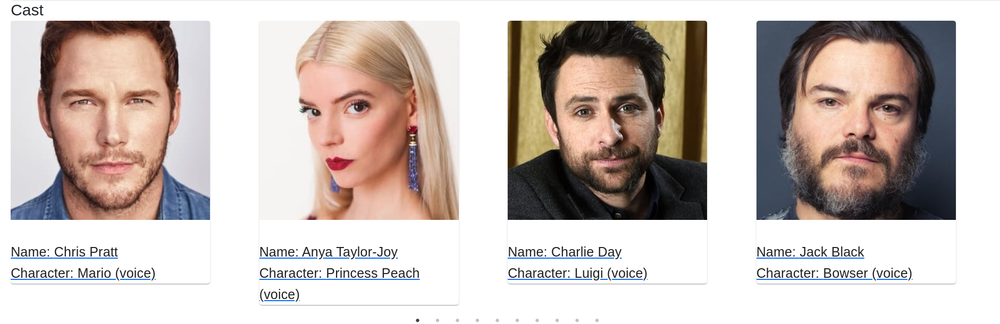

> Cast member Bio page
> 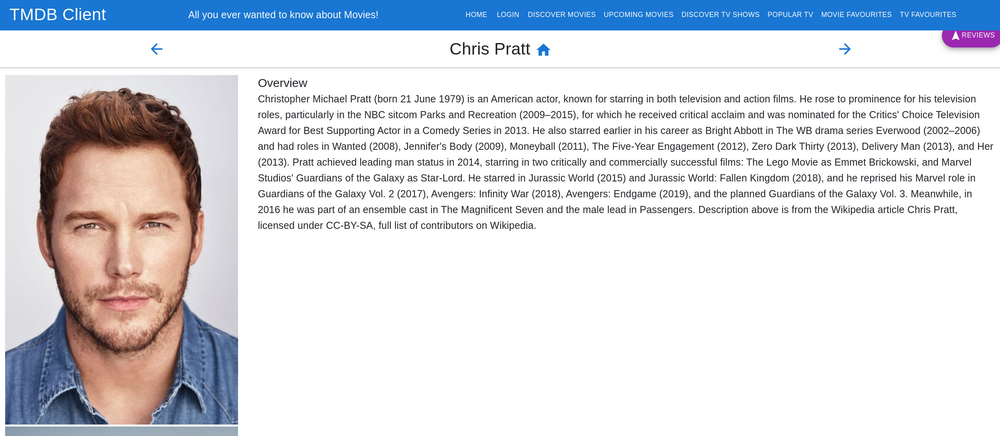

#### Similar movies/tv shows section and pages.

> Similar section showing similar tv shows or movies depending on the page
> 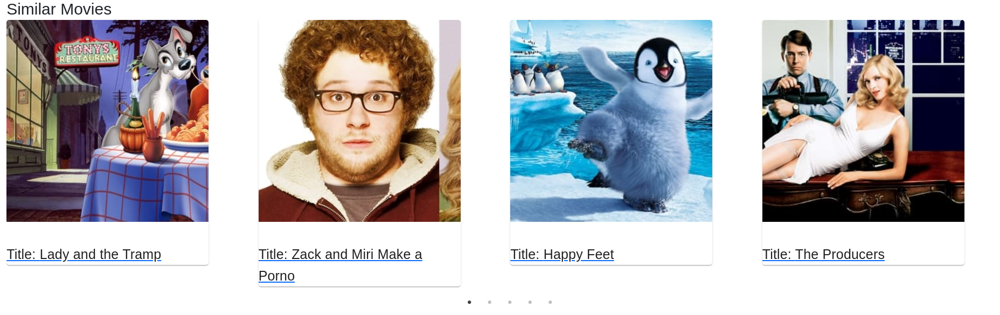

#### Authentication using supabase.

> Login page used to either login or link to registers/reset password pages
> 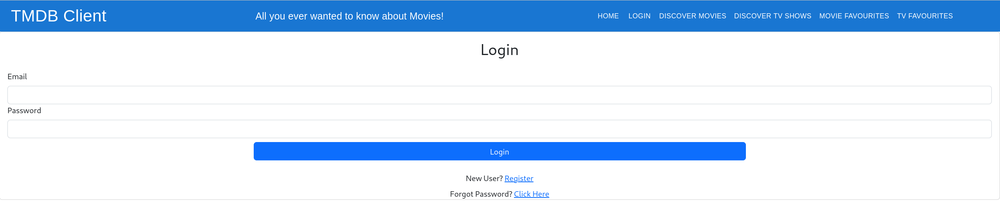

> Register page used to register using email with a confirmation email being sent to the user to confirm account
> 

> Password reset page
> 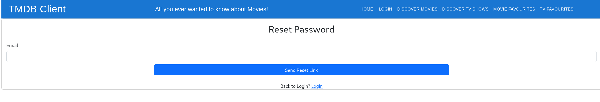

#### Favourite TV Show list using supabase.

> Page showing favourite tv shows saved in the supabase DB
> 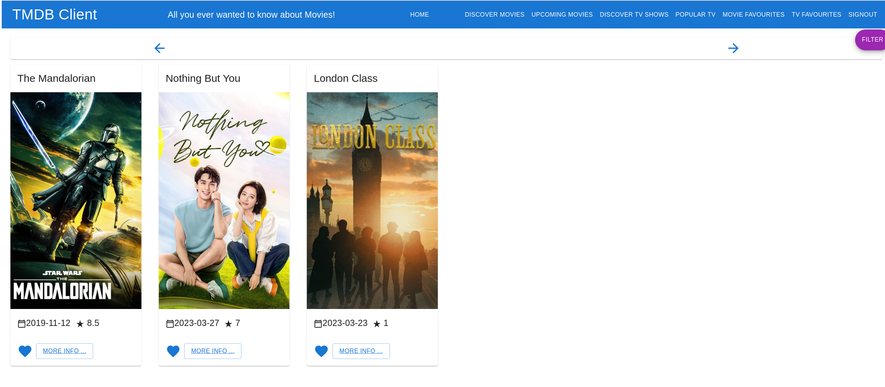

#### Favourite movie list using supabase.

> Page showing favourite movies saved in the supabase DB
> 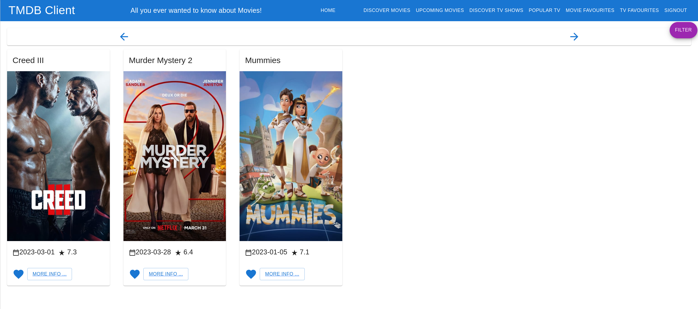

#### Popular TV shows page

> Page showing tv shows from the popular endpoint
> 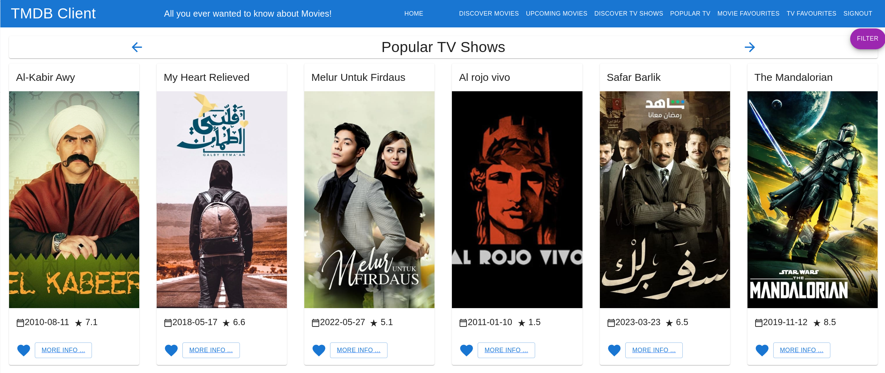

#### Upcoming Movie page

> Page showing moviess from the Upcoming endpoint
> 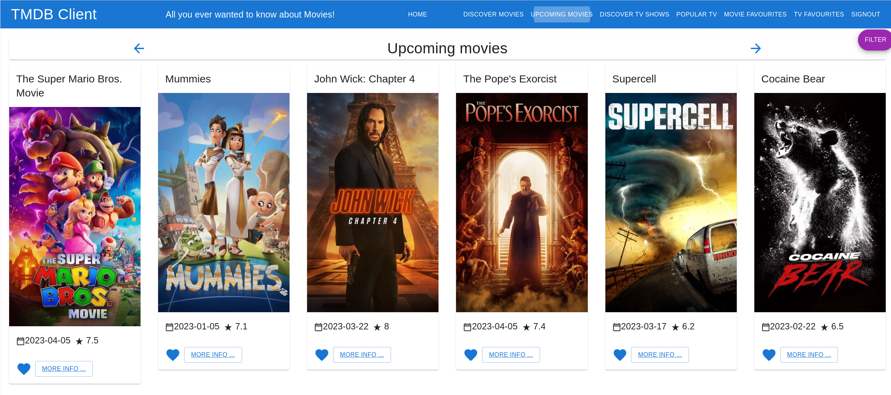

## Authentication.

- /movies/movieFavourites (Protected) - list of favourtied movies stored and retrieved from supabase
- /tvshows/tvFavourites (Protected) - list of favourtied tv shows stored and retrieved from supabase
- /movies/:id - Detailed information on specific movie, retrieved by movie id
- /tvshows/:id - Detailed information on specific tv show, retrieved by tv show id
- /movies/ - List of movies from Discover endpoint
- /movies/upcoming - List of movies from Upcoming endpoint
- /tvshows/ - List of tv shows from Discover endpoint
- /tvshows/popular - List of tv shows from Popular endpoint
- /person/:id - Detailed information on specific actor, retrived by actor id
- /movies/reviews/:id - The full text of a movie review
- /tvshows/reviews/:id - The full text of a tv show review
- /passwordreset - Page with form to reset password by email address
- /register - Page with form to register using email and password
- /login - Page to login using email address and password
- / - Route which directed to discover movies list
- \* - Default redirect for all unknown routes

#### Protected features (if relevant)

Only authenticated users can save and access movie and tv favourites which are stored in supabase. Users can only view their own favourites from the database as it using Row Level Security

#### Supabase (if relevant)

Supabase is used for authentication and storing of favourites

> Userlist showing currently signed up users
> 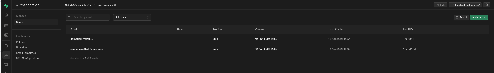

> Favourite TV shows restricted by user_id so users only see their own favourites
> 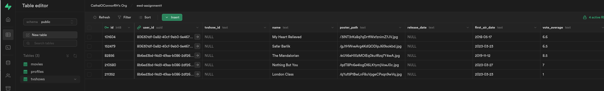

> Favourite Movies restricted by user_id so users only see their own favourites
> 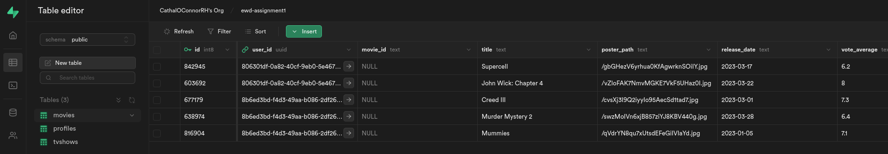

## Deployment (if relevant).

> App is deployed to vercel:
> 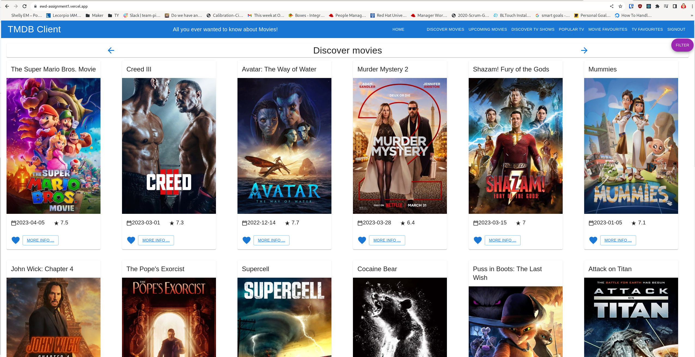

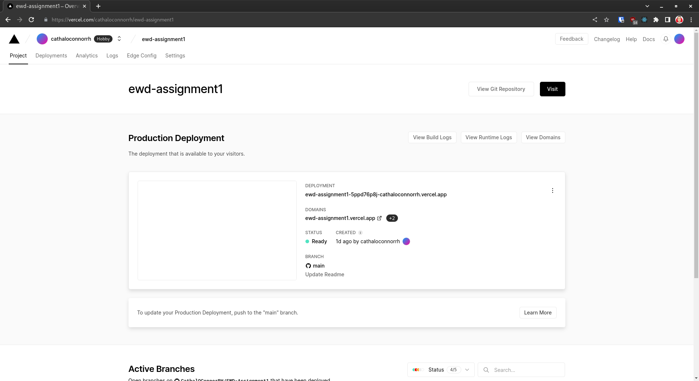

Url is https://ewd-assignment1.vercel.app/

Username: demouser@setu.ie
Password: mftN0D59w^%2

## Persistence (if relevant).

> Favourite TV shows restricted by user_id so users only see their own favourites
> 

> Favourite Movies restricted by user_id so users only see their own favourites
> 

## Additional Information.

- Header shows login/signout depending on auth status.
- Reuse of template page based on type of content eg. tv show, movie, actor
